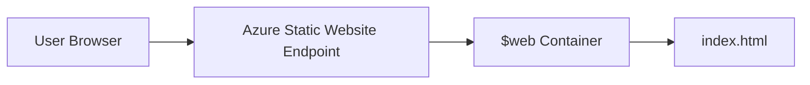

# TRD (Technical Requirements Document)

## 1. 문서 정보
- 시스템명: Hello World Static Web App
- 문서 버전: v1.0
- 작성일: 2026-08-19

## 2. 기술 개요
본 시스템은 Azure Storage Static Website 기능을 사용해 정적 HTML 파일을 서비스한다.
서버 사이드 애플리케이션 없이 단일 `index.html`을 배포해 콘텐츠를 노출한다.

## 3. 현재 구성
- 리소스 그룹: `hello-world-rg`
- 스토리지 계정: `helloworld45102`
- 정적 웹 엔드포인트: `https://helloworld45102.z12.web.core.windows.net/`
- 메인 파일: `index.html`

## 4. 아키텍처

## 5. 기술 스택
- Markup: HTML5
- Styling: Inline CSS (in `index.html`)
- Hosting: Azure Storage Static Website
- CLI: Azure CLI (`az`)

## 6. 파일 및 경로 요구사항
- 필수 파일
  - `index.html`: 루트 페이지
- 권장 파일
  - `404.html`: 에러 페이지

## 7. 배포 요구사항
### 7.1 사전 조건
- Azure CLI 설치
- 유효한 Azure 구독 및 로그인 상태
- 리소스 생성 권한 (Resource Group, Storage Account)

### 7.2 배포 절차 (수동)
1. 리소스 그룹 생성
2. 스토리지 계정 생성 (StorageV2)
3. 정적 웹사이트 기능 활성화 (`index.html`, `404.html` 지정)
4. `$web` 컨테이너에 `index.html` 업로드
5. `primaryEndpoints.web` URL 확인

### 7.3 검증 절차
- URL 접속 후 `Hello World` 문자열 확인
- CLI 검증 예시
  - `curl -s <URL> | findstr "Hello World"`

## 8. 운영 요구사항
### 8.1 변경 관리
- 콘텐츠 수정 시 `index.html` 업데이트 후 재업로드

### 8.2 버전 관리
- Git 기반 변경 이력 관리
- 태그/릴리스 노트는 필요 시 적용

### 8.3 장애 대응
- 증상: URL 접근 실패 또는 404
- 1차 확인: 정적 웹사이트 설정 활성화 여부
- 2차 확인: `$web` 컨테이너 내 `index.html` 존재 여부
- 3차 확인: 계정/네트워크 정책 및 권한 확인

## 9. 보안 요구사항
- 비밀정보(API Key, Connection String)를 코드 저장소에 커밋하지 않는다.
- 공개 정적 콘텐츠만 `$web`에 업로드한다.
- 필요 시 스토리지 계정 접근 정책 및 진단 로그 설정 검토

## 10. 성능 요구사항
- 콘텐츠 크기는 최소화(단일 HTML 중심)
- 렌더링 차단 리소스 최소화
- CDN 연동은 트래픽 증가 시 고려

## 11. 비용 요구사항
- 소규모 트래픽 기준 Azure Storage 정적 호스팅 비용 최소화
- 불필요한 리소스 생성을 제한

## 12. 향후 기술 개선
- GitHub Actions CI/CD 구축
- 커스텀 도메인 + HTTPS 인증서 적용
- Azure Front Door 또는 CDN 연동
- 간단한 접근 로그 시각화 도입
